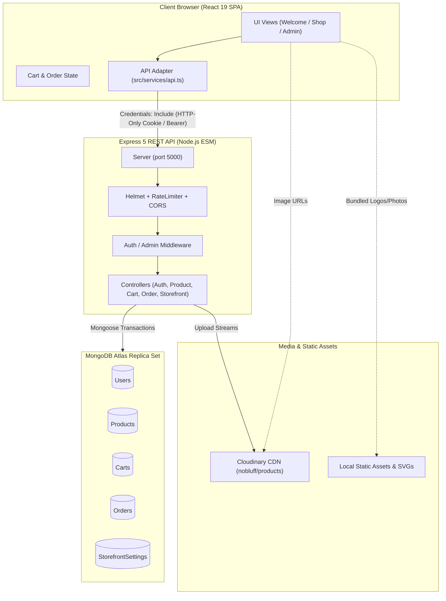
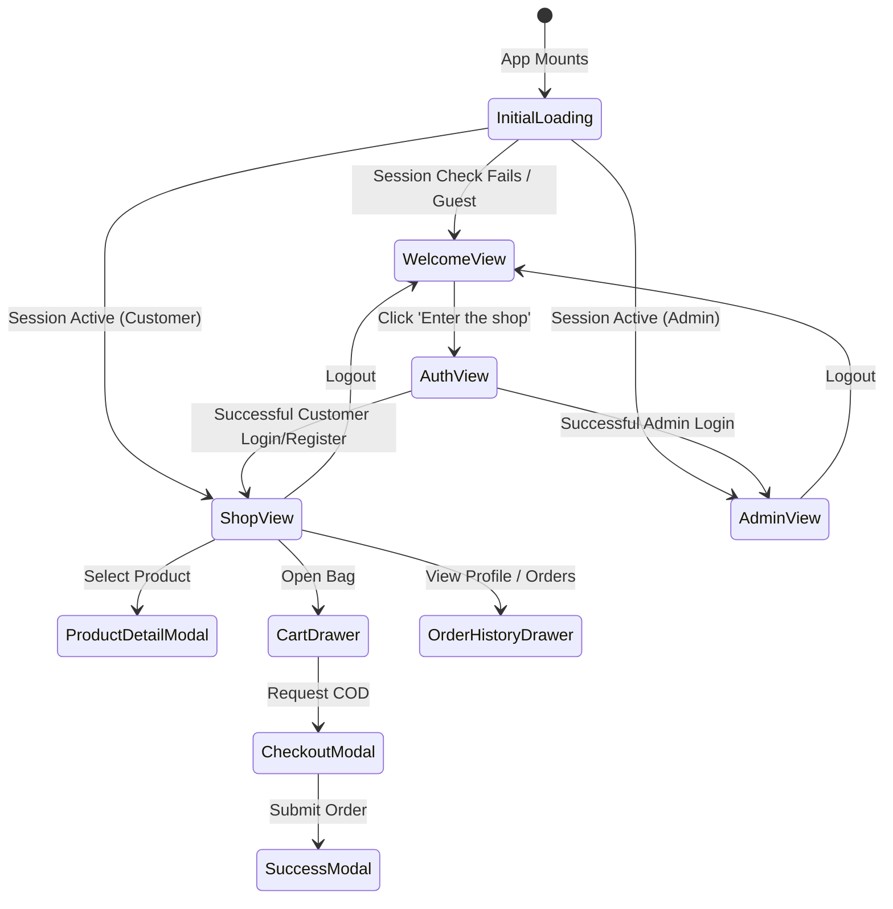
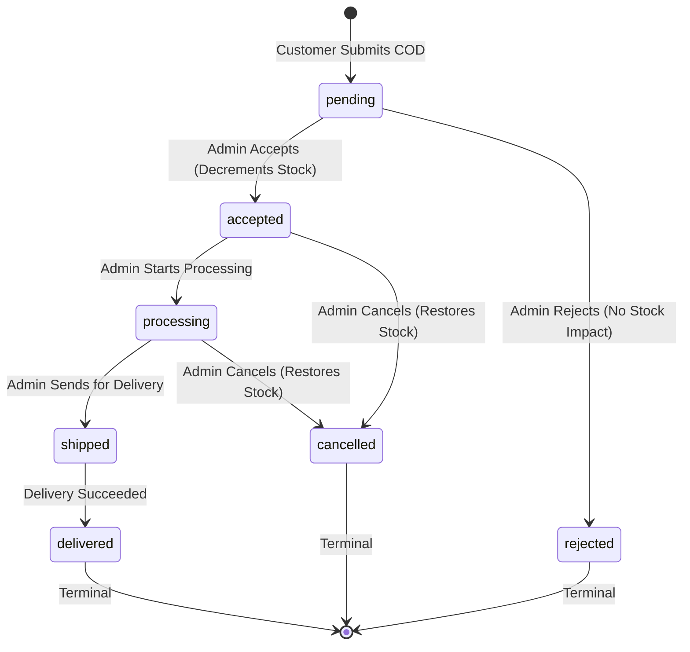

# No Bluff Clothing Outlet — Codebase Knowledge Base & System Manual

> **Complete architectural, algorithmic, and operational reference for the No Bluff e-commerce platform.**
> Includes frontend strategy, Express/Mongoose backend architecture, ACID transaction mechanics, full API route registry, database schemas, security posture, and deployment configuration.

---

## Table of Contents

1. [Executive Summary & Business Model](#1-executive-summary--business-model)
2. [High-Level System Architecture](#2-high-level-system-architecture)
3. [Frontend Architecture & UI Strategy](#3-frontend-architecture--ui-strategy)
   - [Technology Stack](#31-frontend-technology-stack)
   - [Figma Make Scaffold & Vite Plugins](#32-figma-make-scaffold--vite-plugins)
   - [Design System, Theme Tokens & Typography](#33-design-system-theme-tokens--typography)
   - [Application State & View Routing](#34-application-state--view-routing)
   - [Component Hierarchy & Views Breakdown](#35-component-hierarchy--views-breakdown)
   - [Frontend API Service Layer](#36-frontend-api-service-layer)
4. [Backend Architecture & Engine Strategy](#4-backend-architecture--engine-strategy)
   - [Technology Stack](#41-backend-technology-stack)
   - [Server Bootstrap & Lifecycle](#42-server-bootstrap--lifecycle)
   - [Dual Route Mounting & CORS Topology](#43-dual-route-mounting--cors-topology)
   - [DNS Server Overrides & Resilience](#44-dns-server-overrides--resilience)
   - [Cloudinary Media Storage Engine](#45-cloudinary-media-storage-engine)
5. [Database Schemas & Data Models](#5-database-schemas--data-models)
   - [User Model (`User.js`)](#51-user-model)
   - [Product Model (`Product.js`)](#52-product-model)
   - [Cart Model (`Cart.js`)](#53-cart-model)
   - [Order Model (`Order.js`)](#54-order-model)
   - [Storefront Settings Model (`StorefrontSettings.js`)](#55-storefront-settings-model)
6. [Comprehensive API Route Registry](#6-comprehensive-api-route-registry)
   - [Health Check](#61-health-check)
   - [Authentication Endpoints (`/api/auth`)](#62-authentication-endpoints)
   - [Product Endpoints (`/api/products`)](#63-product-endpoints)
   - [Cart Endpoints (`/api/cart`)](#64-cart-endpoints)
   - [Customer Order Endpoints (`/api/orders`)](#65-customer-order-endpoints)
   - [Admin Order Endpoints (`/api/admin/orders`)](#66-admin-order-endpoints)
   - [Storefront Customization Endpoints (`/api/storefront`)](#67-storefront-customization-endpoints)
7. [Order Lifecycle & ACID Transaction Mechanics](#7-order-lifecycle--acid-transaction-mechanics)
   - [Lifecycle State Machine](#71-lifecycle-state-machine)
   - [Cart Checkout & Snapshotting](#72-cart-checkout--snapshotting)
   - [Atomic Inventory Reservation & Reversion](#73-atomic-inventory-reservation--reversion)
8. [Authentication, Sessions & Security Posture](#8-authentication-sessions--security-posture)
   - [JWT Cookie vs Bearer Token Flow](#81-jwt-cookie-vs-bearer-token-flow)
   - [Password Hashing & Strength Requirements](#82-password-hashing--strength-requirements)
   - [Rate Limiting & Defensive Middleware](#83-rate-limiting--defensive-middleware)
9. [Deployment, Environment & Configuration Matrix](#9-deployment-environment--configuration-matrix)
   - [Environment Variables](#91-environment-variables)
   - [Render Deployment Strategy](#92-render-deployment-strategy)
   - [Vercel Deployment Compatibility](#93-vercel-deployment-compatibility)
10. [Database Seeding, Testing & Maintenance Workflows](#10-database-seeding-testing--maintenance-workflows)

---

## 1. Executive Summary & Business Model

**No Bluff** is an apparel outlet based in **Akhnoor (Jammu & Kashmir, India)**, founded by **Rajat Gupta**. The brand emphasizes premium everyday clothing with an unpretentious aesthetic ("Clothes That Speak", "All Style, No Bluff").

### Retail Business Mechanics
- **Model**: Direct-to-Consumer (D2C) Cash on Delivery (COD) Storefront.
- **Zero Online Payment Gateway Risk**: There is intentionally **no credit card, UPI, or payment gateway integration**. Customers submit a formal COD order request.
- **Human-in-the-Loop Fulfillment**: Orders arrive in the backend in a `pending` status. Store personnel contact the customer via phone (+91) to confirm sizing, physical delivery address, and availability before an administrator explicitly approves the order.
- **Dynamic Storefront Styling**: Physical brands stocked in the Akhnoor brick-and-mortar outlet (e.g., Citrus, Devis Jeans, Technosport, Sanskaram, Charlie, Zeel) and curated category tiles can be modified directly by the admin without redeploying code.
- **Physical Store Contact**:
  - Address: Near Kameshwar Mandir, Besides Petrol Pump, Akhnoor, J&K
  - Phone: `+91 95966 83583`

---

## 2. High-Level System Architecture



---

## 3. Frontend Architecture & UI Strategy

### 3.1 Frontend Technology Stack
- **Framework**: [React 19](https://react.dev/) (`react: ^19.0.0`, `react-dom: ^19.0.0`)
- **Build System**: [Vite 8](https://vitejs.dev/) (`vite: ^8.0.5`)
- **Language**: [TypeScript 5.7](https://www.typescriptlang.org/) (`typescript: ^5.7.0`)
- **Styling**: [Tailwind CSS v4](https://tailwindcss.com/) with `@tailwindcss/vite: ^4.0.0`
- **Animations**: [lottie-react](https://github.com/Gamote/lottie-react) (`^3.1.2`) driving `Loading Animation Circle.json`
- **Code Formatting / Linting**: `oxfmt` (`^0.2.0`)

### 3.2 Figma Make Scaffold & Vite Plugins
The application was bootstrapped inside **Figma Make** and maintains tight integrations inside [`vite.config.ts`](file:///c:/Users/manis/pvt%20LTD/nobluff%20website/vite.config.ts):

1. **`figmaSiteConfiguration(siteConfiguration)`**:
   Reads `.figma/make/site.json` and injects customized metadata into `index.html` at build/dev time:
   - Sets title (default: `"NoBluff"`), OpenGraph tags, meta description, and favicon.
   - Dynamically injects Google Analytics script (`gtag`) if `analytics.googleAnalyticsId` is present.
   - Injects `.figma-bypass-link` for accessibility skip links.
   - Intercepts requests for `/robots.txt` if indexation is disabled.

2. **`figmaErrorOverlayReplay()`**:
   Caches recent Vite build/transpile errors in memory and replays them via WebSockets when new preview sockets connect, ensuring iframe reloads never miss error banners.

3. **`figmaReactRefreshBoundaryFallback()`**:
   Watches for files that lose React Refresh boundaries (e.g., during refactor re-exports) and executes microtask full-reloads to prevent stale mounted React component states.

4. **`figmaMakeKitPlugin()`**:
   Exposes a dev-only virtual route `/.figma/make/kit.html` backed by `virtual:figma-stories` using `import.meta.glob('/src/**/*.stories.{ts,tsx,js,jsx}')`.

### 3.3 Design System, Theme Tokens & Typography
Defined globally in [`src/index.css`](file:///c:/Users/manis/pvt%20LTD/nobluff%20website/src/index.css):

#### Color Palette
| Token | Hex / Value | Semantic Role |
| :--- | :--- | :--- |
| `--ink` | `#1f1c18` | Primary text, deep charcoal buttons, high contrast accents |
| `--muted` | `#716a61` | Subtitles, helper text, secondary descriptions |
| `--sand` | `#eee4d6` | Neutral surfaces, secondary button backgrounds (`btn-soft`) |
| `--cream` | `#f8f3ea` | Default canvas background, warm organic editorial feel |
| `--white` | `#fffdf8` | High-light card backgrounds, crisp contrasts |
| `--clay` | `#a96846` | Brand terracotta highlight, price savings, badges |
| `--clay-dark` | `#75472f` | Hover states on primary buttons |
| `--sage` | `#69715e` | Organic accent tint |
| `--line` | `rgba(31, 28, 24, 0.12)` | Subtle dividing borders |

#### Typography
- **Primary Body & Interface**: Google Fonts `"DM Sans"` (Weights 400, 500, 600, 700). Clean geometric legibility.
- **Editorial Headings**: Google Fonts `"DM Serif Display"` (Weights 400, regular & italic). Conveys warmth, craftsmanship, and boutique luxury.
- **Italic Emphasis Rule**: Important brand slogans use italic serif styling within headers:
  ```html
  <h1>Simple by choice.<br /><em>Original by nature.</em></h1>
  ```

#### Neumorphic-Editorial Shadows
- **Card Shadow**: `14px 14px 32px rgba(113, 84, 56, 0.14), -10px -10px 26px rgba(255, 255, 255, 0.64)`
- **Small Button Shadow**: `7px 7px 18px rgba(113, 84, 56, 0.13), -6px -6px 16px rgba(255, 255, 255, 0.7)`

### 3.4 Application State & View Routing
The application in [`src/App.tsx`](file:///c:/Users/manis/pvt%20LTD/nobluff%20website/src/App.tsx) uses a single-page view-state router:



#### Key State Variables
- `view`: Current screen (`"welcome"` | `"auth"` | `"shop"`).
- `user`: Active authenticated session (`ApiUser | null`).
- `products`: Catalog array fetched from `/api/products`.
- `categoryTiles`: Visual category tiles from `/api/storefront` (falls back to hardcoded `visualCategories`).
- `brandImageOverrides`: Logo mappings for the moving marquee from `/api/storefront`.
- `cart`: Array of items currently in the user's active bag.
- `orders`: Admin order queue (only fetched if `user.role === "admin"`).
- `customerOrders`: Personal order history (only fetched for `user.role === "customer"`).
- `selectedProduct`: Product currently opened in the detailed view modal.
- `confettiBurst`: Numeric counter triggering particle celebrations when adding items to cart.

### 3.5 Component Hierarchy & Views Breakdown

1. **`LoadingScreen`** ([`src/LoadingScreen.tsx`](file:///c:/Users/manis/pvt%20LTD/nobluff%20website/src/LoadingScreen.tsx)):
   Full-screen loader with centered Lottie vector animation and text indicator.
2. **`WelcomePage`** ("The Founder's Edit"):
   - Bleed background image featuring founder **Rajat Gupta**.
   - Circular logo badge with the No Bluff crest.
   - Endless infinite-scrolling marquee (`brand-marquee`) showcasing partnered manufacturer brands.
3. **`AuthPage`**:
   - Toggle between **Login** and **Sign Up**.
   - Form fields: Full name (Sign Up only), Email, Password (minimum 8 chars for signup).
   - Instant loading transition with validation error messaging.
4. **`Shop View`**:
   - **`SiteHeader`**: Sticky navigation bar containing mobile hamburger toggle, logo, category shortcut links, live search bar, wishlist trigger, bag trigger with item counter badge, and profile/logout actions.
   - **`HeroSection`**: Editorial promotion ("New fit. Same vibe. New Season 2026") with CTA to scroll to the shop.
   - **`CategoryShowcase`**: Rail of interactive photo cards to filter by style (Ethnic Wear, Casual Wear, Activewear, Western Wear, Outerwear, Accessories).
   - **`BenefitPillars`**: 3 highlights: "Curated quality", "Cash on delivery", "Easy requests".
   - **`ShopSection`**: Dynamic filter pill bar, 4-column responsive grid of products with price strike-throughs and discount badges, expandable via "Show more / Show fewer" button.
   - **`StorySection`**: "The No Bluff Promise" narrative and photography.
   - **`Footer`**: Akhnoor physical address, telephone contact link, copyright note.
5. **`ProductDetail` Modal**:
   - High-resolution product image gallery with "THE EDIT · 01" tag.
   - Size selector (`S, M, L, XL` or `One size`).
   - Color swatch indicator.
   - Accordion specs: "Fit & feel", "Material & care", "Delivery".
   - Customer review section with ratings and verified purchase badges.
   - "Add to bag" CTA with direct price tag.
6. **`CartDrawer` & `CheckoutModal`**:
   - Slide-over right drawer.
   - Real-time line item quantity adjustments (`+`, `-`) or removal (`trash`).
   - Order note and delivery address capture form.
7. **`AdminPage` (Store Command Center)**:
   Divided into three tabs:
   - **Orders Tab**: Status pipeline filters (`All`, `Pending`, `Approved`, `Rejected`, `Processing`, `Shipped`, `Delivered`, `Cancelled`), customer delivery data, and transition action triggers.
   - **Products Tab**: Catalog grid, Add Product modal with Multer/Cloudinary file upload, category tile manager, and brand logo marquee replacement.
   - **Customers Tab**: Aggregated customer directory showing lifetime spend, order count, and contact numbers.

### 3.6 Frontend API Service Layer
Located at [`src/services/api.ts`](file:///c:/Users/manis/pvt%20LTD/nobluff%20website/src/services/api.ts).

#### Base URL Normalization
Ensures that whether `VITE_API_URL` is set to `https://api.example.com` or `https://api.example.com/api` (or omitted), requests cleanly resolve:
```typescript
function normalizeApiBase(value: string | undefined) {
  const base = (value || "http://localhost:5000/api").replace(/\/$/, "")
  return new URL(base).pathname === "/" ? `${base}/api` : base
}
```

#### Standard Request Envelope Handling
Every HTTP call passes `credentials: "include"`, automatically transmitting cross-site HTTP-only cookies:
```typescript
async function request<T>(path: string, options: RequestInit = {}): Promise<T> {
  const headers = new Headers(options.headers)
  if (options.body && !(options.body instanceof FormData)) {
    headers.set("Content-Type", "application/json")
  }
  const response = await fetch(`${apiBase}${path}`, {
    ...options,
    headers,
    credentials: "include",
  })
  const envelope = (await response.json()) as ApiEnvelope<T>
  if (!response.ok || !envelope.success) {
    throw new Error(envelope.success ? "The request failed" : envelope.message)
  }
  return envelope.data
}
```

---

## 4. Backend Architecture & Engine Strategy

### 4.1 Backend Technology Stack
- **Runtime**: Node.js (ESM native, `"type": "module"`)
- **HTTP Framework**: [Express 5](https://expressjs.com/) (`express: ^5.1.0`)
- **Object Modeling**: [Mongoose 8](https://mongoosejs.com/) (`mongoose: ^8.19.1`)
- **Database**: MongoDB Atlas (Requires replica set for transactions)
- **Token Handling**: [jsonwebtoken](https://github.com/auth0/node-jsonwebtoken) (`jsonwebtoken: ^9.0.2`)
- **Password Security**: [bcryptjs](https://github.com/dcodeIO/bcrypt.js) (`bcryptjs: ^3.0.2`)
- **Media Engine**: [Cloudinary SDK](https://cloudinary.com/documentation/node_integration) (`cloudinary: ^2.11.0`)
- **File Upload Parsing**: [multer](https://github.com/expressjs/multer) (`multer: ^2.4.0`)
- **Defensive Middleware**: [helmet](https://helmetjs.github.io/) (`^8.1.0`), [express-rate-limit](https://express-rate-limit.mintlify.app/) (`^8.1.0`), [cookie-parser](https://github.com/expressjs/cookie-parser) (`^1.4.7`), [cors](https://github.com/expressjs/cors) (`^2.8.5`)
- **Schema Validation**: [Zod](https://zod.dev/) (`zod: ^3.25.76`)

### 4.2 Server Bootstrap & Lifecycle
Located in [`backend/src/server.js`](file:///c:/Users/manis/pvt%20LTD/nobluff%20website/backend/src/server.js):
1. Loads environment variables via `dotenv/config`.
2. Validates that `JWT_SECRET` exists and has **at least 32 characters** (fails fast on startup if insecure).
3. Connects to MongoDB Atlas via `connectDatabase()`.
4. Starts the HTTP listener on `PORT` (defaults to 5000).

### 4.3 Dual Route Mounting & CORS Topology
Located in [`backend/src/app.js`](file:///c:/Users/manis/pvt%20LTD/nobluff%20website/backend/src/app.js):

#### Dual Route Mounting Strategy
To ensure maximum compatibility whether the frontend calls `/api/products` or `/products`, **all routes are mounted twice**:
```javascript
app.use("/api/auth", authRoutes)
app.use("/auth", authRoutes)

app.use("/api/products", productRoutes)
app.use("/products", productRoutes)

app.use("/api/cart", cartRoutes)
app.use("/cart", cartRoutes)

app.use("/api/orders", orderRoutes)
app.use("/orders", orderRoutes)

app.use("/api/admin", adminRoutes)
app.use("/admin", adminRoutes)

app.use("/api/storefront", storefrontRoutes)
app.use("/storefront", storefrontRoutes)
```

#### CORS Security Rules
- **Static Allowed Origins**: `http://localhost:8443`, `http://localhost:5173`, `http://127.0.0.1:8443`, `http://127.0.0.1:5173`, `https://nobluff-ecommerce.vercel.app`.
- **Environment Origins**: Supports comma-separated origins from `CLIENT_URL`, `CLIENT_URLS`, `FRONTEND_URL`, and `FRONTEND_URLS`.
- **Wildcard Vercel Previews**: Validates any preview URL matching `https://nobluff-ecommerce-*.vercel.app`.
- **Credentials Support**: Explicitly allows cross-site cookies with `credentials: true`.

### 4.4 DNS Server Overrides & Resilience
Located in [`backend/src/config/db.js`](file:///c:/Users/manis/pvt%20LTD/nobluff%20website/backend/src/config/db.js):
```javascript
import dns from "node:dns"
dns.setServers(["1.1.1.1", "8.8.8.8"])
```
> [!NOTE]
> MongoDB `mongodb+srv://` URIs rely on DNS SRV records. In many cloud container environments (such as Render, Docker, or WSL), default local resolvers fail SRV resolution. Hardcoding Cloudflare (`1.1.1.1`) and Google (`8.8.8.8`) DNS guarantees bulletproof MongoDB Atlas connectivity.

### 4.5 Cloudinary Media Storage Engine
Located in [`backend/src/config/cloudinary.js`](file:///c:/Users/manis/pvt%20LTD/nobluff%20website/backend/src/config/cloudinary.js):
- Checks for `CLOUDINARY_CLOUD_NAME`, `CLOUDINARY_API_KEY`, and `CLOUDINARY_API_SECRET`.
- When an admin uploads an image (`multipart/form-data`), Multer stores it in memory (`multer.memoryStorage()`) with an 8 MB size cap.
- Streams the buffer directly to Cloudinary folder `nobluff/products` using Node streams:
  ```javascript
  Readable.from(buffer).pipe(uploadStream)
  ```
- Returns `{ url, publicId }`. If Cloudinary credentials are not configured, the API gracefully declines uploads with HTTP 503, but still permits saving external image URLs.

---

## 5. Database Schemas & Data Models

### 5.1 User Model
File: [`backend/src/models/User.js`](file:///c:/Users/manis/pvt%20LTD/nobluff%20website/backend/src/models/User.js)

```javascript
{
  name: { type: String, required: true, trim: true, minlength: 2, maxlength: 100 },
  email: { type: String, required: true, unique: true, lowercase: true, trim: true, maxlength: 254 },
  password: { type: String, required: true, select: false, minlength: 8 },
  phone: { type: String, trim: true, maxlength: 30, default: "" },
  role: { type: String, enum: ["customer", "admin"], default: "customer" },
  addresses: [{
    label: String,
    line1: String,
    city: String,
    postalCode: String,
    country: { type: String, default: "India" }
  }],
  timestamps: true
}
```
- **Lifecycle Hook**: `pre("save")` hashes password via `bcrypt.hash(password, 12)` if modified.
- **Instance Method**: `comparePassword(plaintext)` verifies hash.

### 5.2 Product Model
File: [`backend/src/models/Product.js`](file:///c:/Users/manis/pvt%20LTD/nobluff%20website/backend/src/models/Product.js)

```javascript
{
  name: { type: String, required: true, trim: true, maxlength: 160 },
  slug: { type: String, required: true, unique: true, trim: true, lowercase: true },
  description: { type: String, trim: true, maxlength: 5000, default: "" },
  price: { type: Number, required: true, min: 0 },
  compareAtPrice: { type: Number, min: 0, default: null },
  images: [{ url: String, publicId: String }],
  category: { type: String, required: true, trim: true, maxlength: 80 },
  sizes: [String],
  colors: [String],
  stock: { type: Number, required: true, min: 0, default: 0 },
  sku: { type: String, trim: true, uppercase: true, sparse: true, unique: true },
  isActive: { type: Boolean, default: true },
  timestamps: true
}
```
- **Indexes**:
  - `{ isActive: 1, category: 1 }`: Fast catalog queries.
  - `{ name: "text", description: "text" }`: Full-text search index.
- **Soft Deletion**: `deleteProduct` updates `isActive: false` rather than destroying the document, preserving historical order referential integrity.

### 5.3 Cart Model
File: [`backend/src/models/Cart.js`](file:///c:/Users/manis/pvt%20LTD/nobluff%20website/backend/src/models/Cart.js)

```javascript
{
  userId: { type: ObjectId, ref: "User", required: true, unique: true },
  items: [{
    productId: { type: ObjectId, ref: "Product", required: true },
    quantity: { type: Number, required: true, min: 1, max: 99 },
    selectedSize: { type: String, default: "" },
    selectedColor: { type: String, default: "" },
    price: { type: Number, required: true, min: 0 }
  }],
  timestamps: true
}
```
- **Self-Healing Mechanics**: When `getCart` is invoked, the controller iterates items:
  1. If a product was deactivated (`isActive: false`) or deleted, it is removed from the cart.
  2. If the product price changed in the catalog, the cart line item price is updated to match current live pricing.

### 5.4 Order Model
File: [`backend/src/models/Order.js`](file:///c:/Users/manis/pvt%20LTD/nobluff%20website/backend/src/models/Order.js)

```javascript
{
  orderNumber: { type: String, required: true, unique: true },
  userId: { type: ObjectId, ref: "User", required: true, index: true },
  customerName: { type: String, required: true, trim: true, maxlength: 100 },
  customerEmail: { type: String, required: true, lowercase: true, trim: true },
  items: [{
    productId: { type: ObjectId, ref: "Product", required: true },
    name: { type: String, required: true },
    image: { type: String, default: "" },
    quantity: { type: Number, required: true, min: 1 },
    selectedSize: { type: String, default: "" },
    selectedColor: { type: String, default: "" },
    price: { type: Number, required: true, min: 0 }
  }],
  shippingAddress: {
    line1: { type: String, required: true },
    city: { type: String, required: true },
    postalCode: { type: String, required: true },
    country: { type: String, default: "India" }
  },
  phone: { type: String, required: true, trim: true },
  note: { type: String, default: "" },
  subtotal: { type: Number, required: true, min: 0 },
  shippingFee: { type: Number, required: true, min: 0, default: 0 },
  totalAmount: { type: Number, required: true, min: 0 },
  paymentMethod: { type: String, enum: ["COD"], default: "COD" },
  status: {
    type: String,
    enum: ["pending", "accepted", "rejected", "processing", "shipped", "delivered", "cancelled"],
    default: "pending",
    index: true
  },
  adminNote: { type: String, default: "" },
  timestamps: true
}
```
- **Order Number Generation**: Automatically assigns a formatted string during `pre("validate")`:
  ```javascript
  `NB${Date.now().toString().slice(-8)}${Math.random().toString(36).slice(2, 5).toUpperCase()}`
  // Example: NB28491820XYZ
  ```
- **Compound Index**: `{ userId: 1, createdAt: -1 }` for customer order history sorting.

### 5.5 Storefront Settings Model
File: [`backend/src/models/StorefrontSettings.js`](file:///c:/Users/manis/pvt%20LTD/nobluff%20website/backend/src/models/StorefrontSettings.js)

```javascript
{
  key: { type: String, required: true, unique: true, default: "default" },
  categoryTiles: [{
    id: Number,
    name: String,
    note: String,
    filter: String,
    image: String
  }],
  brandImages: [{
    id: String,
    url: String
  }],
  welcomeHeroImage: { type: String, default: "" },
  timestamps: true
}
```
- **Singleton Pattern**: Managed via document `key: "default"`. Guarantees a single centralized record for global homepage tiles, founder hero image, and moving brand logos.

---

## 6. Comprehensive API Route Registry

All JSON endpoints respond with a standardized envelope:
- **Success**: `{ "success": true, "data": { ... } }`
- **Error**: `{ "success": false, "message": "Reason description" }`

### 6.1 Health Check
| Endpoint | Method | Access | Purpose |
| :--- | :--- | :--- | :--- |
| `/api/health` | `GET` | Public | Ping to verify API and process status |

- **Response `200 OK`**:
  ```json
  { "success": true, "data": { "status": "ok" } }
  ```

---

### 6.2 Authentication Endpoints
Mounted at `/api/auth` (and `/auth`). Rate-limited to **30 attempts per 15 minutes**.

#### `POST /api/auth/register`
Registers a new customer account, issues a JWT in the `nobluff_session` cookie.
- **Access**: Public
- **Validation**:
  - `name`: String, 2–100 chars
  - `email`: Valid email address (normalized to lowercase)
  - `password`: String, 8–128 chars
- **Response `201 Created`**:
  ```json
  {
    "success": true,
    "data": {
      "user": {
        "id": "675001a4b9c1d2e3f4a5b6c7",
        "name": "Jane Doe",
        "email": "jane@example.com",
        "phone": "",
        "role": "customer"
      }
    }
  }
  ```

#### `POST /api/auth/login`
Authenticates email and password, issues a JWT in the `nobluff_session` cookie.
- **Access**: Public
- **Validation**:
  - `email`: Valid email string
  - `password`: String, 1–128 chars
- **Response `200 OK`**: Same envelope as register.
- **Error `401 Unauthorized`**: If user not found or password fails comparison.

#### `GET /api/auth/me`
Fetches user details for the active session.
- **Access**: Authenticated (`requireAuth`)
- **Headers / Cookies**: `nobluff_session` cookie or `Authorization: Bearer <token>`
- **Response `200 OK`**: `{ "success": true, "data": { "user": { ... } } }`

#### `POST /api/auth/logout`
Clears the `nobluff_session` cookie.
- **Access**: Public
- **Response `200 OK`**:
  ```json
  { "success": true, "data": { "message": "Signed out" } }
  ```

---

### 6.3 Product Endpoints
Mounted at `/api/products` (and `/products`).

#### `GET /api/products`
Lists active products with filtering, search, sorting, and pagination.
- **Access**: Public
- **Query Parameters**:
  - `page`: Integer (default: 1)
  - `limit`: Integer (default: 24, max: 60)
  - `category`: Category name string
  - `size`: Size string filter (matches within `sizes` array)
  - `color`: Color string filter (matches within `colors` array)
  - `minPrice` / `maxPrice`: Numeric price range
  - `search`: Case-insensitive text search against name and description
  - `sort`: `"price"` | `"name"` | `"newest"` (default: `"newest"`)
  - `direction`: `"asc"` | `"desc"` (default: `"desc"`)
- **Response `200 OK`**:
  ```json
  {
    "success": true,
    "data": {
      "products": [ /* Product Objects */ ],
      "pagination": { "page": 1, "limit": 24, "total": 12, "pages": 1 }
    }
  }
  ```

#### `GET /api/products/:id`
Retrieves a single active product by Mongo ID.
- **Access**: Public
- **Response `200 OK`**: `{ "success": true, "data": { "product": { ... } } }`
- **Error `404 Not Found`**: If inactive or missing.

#### `GET /api/products/slug/:slug`
Retrieves a single active product by its URL-friendly slug.
- **Access**: Public
- **Response `200 OK`**: `{ "success": true, "data": { "product": { ... } } }`

#### `POST /api/products`
Creates a new product document.
- **Access**: Admin only (`requireAuth`, `requireAdmin`)
- **Validation**:
  - `name`: String, 1–160 chars (Auto-slugified if slug is omitted)
  - `category`: String, 1–80 chars
  - `price`: Number >= 0
  - `compareAtPrice`: Optional Number or null
  - `stock`: Integer, 0–100,000
  - `sizes`: Optional array of strings
  - `colors`: Optional array of strings
  - `images`: Optional array of `{ url, publicId }`
  - `image`: Optional direct string URL
- **Response `201 Created`**: `{ "success": true, "data": { "product": { ... } } }`

#### `PUT /api/products/:id`
Updates an existing product.
- **Access**: Admin only (`requireAuth`, `requireAdmin`)
- **Validation**: Partial schema of Product.
- **Response `200 OK`**: `{ "success": true, "data": { "product": { ... } } }`

#### `DELETE /api/products/:id`
Soft-deactivates product (`isActive: false`).
- **Access**: Admin only (`requireAuth`, `requireAdmin`)
- **Response `200 OK`**: `{ "success": true, "data": { "product": { ... } } }`

#### `POST /api/products/image-upload`
Uploads a binary image file to Cloudinary.
- **Access**: Admin only (`requireAuth`, `requireAdmin`)
- **Content-Type**: `multipart/form-data` (Field name: `image`, max 8 MB)
- **Supported Formats**: JPEG, PNG, WebP, GIF
- **Response `201 Created`**:
  ```json
  {
    "success": true,
    "data": {
      "image": {
        "url": "https://res.cloudinary.com/.../nobluff/products/xyz.jpg",
        "publicId": "nobluff/products/xyz"
      }
    }
  }
  ```

---

### 6.4 Cart Endpoints
Mounted at `/api/cart` (and `/cart`). Requires customer role (`requireAuth`, `requireCustomer`).

#### `GET /api/cart`
Reads user's current shopping cart with self-healing price and availability synchronization.
- **Response `200 OK`**:
  ```json
  {
    "success": true,
    "data": {
      "cart": {
        "_id": "...",
        "userId": "...",
        "items": [
          {
            "_id": "...",
            "productId": { /* Populated Product Document */ },
            "quantity": 2,
            "selectedSize": "L",
            "selectedColor": "Clay",
            "price": 1890
          }
        ]
      }
    }
  }
  ```

#### `POST /api/cart`
Adds an item or increments an existing combination of (Product + Size + Color).
- **Validation**:
  - `productId`: 24-character hexadecimal ObjectId
  - `quantity`: Integer 1–99 (default: 1)
  - `selectedSize`: String (must exist in product's sizes array)
  - `selectedColor`: String (must exist in product's colors array)
- **Stock Guard**: If requested quantity exceeds catalog `stock`, returns `409 Conflict`.
- **Response `200 OK`**: Updated cart.

#### `PUT /api/cart/:itemId`
Updates quantity of a specific cart line item.
- **Validation**: `quantity`: Integer 1–99.
- **Stock Guard**: Returns `409 Conflict` if new quantity exceeds current product stock.
- **Response `200 OK`**: Updated cart.

#### `DELETE /api/cart/:itemId`
Removes a specific line item from the cart.
- **Response `200 OK`**: Updated cart.

#### `DELETE /api/cart`
Clears all line items from the user's cart.
- **Response `200 OK`**: Empty cart `{ "items": [] }`.

---

### 6.5 Customer Order Endpoints
Mounted at `/api/orders` (and `/orders`). Requires customer role (`requireAuth`, `requireCustomer`).

#### `POST /api/orders`
Submits a COD order request. Empties the server cart within an atomic transaction.
- **Validation**:
  - `phone`: String, 7–30 chars (Mandatory for calling customer)
  - `shippingAddress.line1`: String, 3–200 chars
  - `shippingAddress.city`: String, 2–80 chars
  - `shippingAddress.postalCode`: String, 4–12 chars
  - `shippingAddress.country`: String (default: `"India"`)
  - `note`: Optional string <= 500 chars
- **Stock Checking**: Validates that all items in cart still have sufficient stock (without decrementing).
- **Response `201 Created`**:
  ```json
  {
    "success": true,
    "data": {
      "order": {
        "_id": "...",
        "orderNumber": "NB491820XYZ",
        "customerName": "Jane Doe",
        "customerEmail": "jane@example.com",
        "phone": "+91 95966 83583",
        "items": [ /* Snapshotted items */ ],
        "subtotal": 3780,
        "shippingFee": 0,
        "totalAmount": 3780,
        "status": "pending",
        "createdAt": "..."
      }
    }
  }
  ```

#### `GET /api/orders`
Lists the logged-in customer's own order history.
- **Response `200 OK`**: `{ "success": true, "data": { "orders": [ ... ] } }`

---

### 6.6 Admin Order Endpoints
Mounted at `/api/admin/orders` (and `/admin/orders`). Requires admin role (`requireAuth`, `requireAdmin`).

#### `GET /api/admin/orders`
Lists all store orders up to 200 documents, sorted newest first.
- **Query Parameter**: `status`: Optional filter (`pending`, `accepted`, etc.)
- **Response `200 OK`**: `{ "success": true, "data": { "orders": [ ... ] } }`

#### `GET /api/admin/orders/:id`
Retrieves a single order with populated customer user data.
- **Response `200 OK`**: `{ "success": true, "data": { "order": { ... } } }`

#### `PATCH /api/admin/orders/:id/accept`
Accepts a `pending` order. **Atomically checks and decrements catalog inventory.**
- **Validation**: `adminNote`: Optional string <= 1000 chars.
- **Status Transition**: Changes status to `"accepted"`.
- **Error `409 Conflict`**: If order is not in `pending` status or any item lacks sufficient stock.
- **Response `200 OK`**: Updated order.

#### `PATCH /api/admin/orders/:id/reject`
Rejects a `pending` order without affecting inventory.
- **Validation**: `adminNote`: Optional string <= 1000 chars.
- **Status Transition**: Changes status to `"rejected"`.
- **Response `200 OK`**: Updated order.

#### `PATCH /api/admin/orders/:id/status`
Advances an order or cancels it.
- **Validation**:
  - `status`: Enum (`"processing"`, `"shipped"`, `"delivered"`, `"cancelled"`)
  - `adminNote`: Optional string <= 1000 chars
- **Stock Reversion**: If moved to `"cancelled"`, **atomically restores inventory** for all items.
- **Response `200 OK`**: Updated order.

---

### 6.7 Storefront Customization Endpoints
Mounted at `/api/storefront` (and `/storefront`).

#### `GET /api/storefront`
Reads dynamic homepage category tiles and brand image overrides.
- **Access**: Public
- **Response `200 OK`**:
  ```json
  {
    "success": true,
    "data": {
      "categoryTiles": [
        { "id": 1, "name": "Ethnic Wear", "note": "Festive silhouettes", "filter": "All", "image": "..." }
      ],
      "brandImages": [
        { "id": "citrus", "url": "..." }
      ]
    }
  }
  ```

#### `PUT /api/storefront`
Updates shared storefront category tiles or brand images for all visitors.
- **Access**: Admin only (`requireAuth`, `requireAdmin`)
- **Validation**:
  - `categoryTiles`: Array of up to 40 items (`id`, `name`, `note`, `filter`, `image`)
  - `brandImages`: Array of up to 20 items (`id`, `url`)
- **Response `200 OK`**: Updated settings.

---

## 7. Order Lifecycle & ACID Transaction Mechanics

### 7.1 Lifecycle State Machine
Located in [`backend/src/utils/orderWorkflow.js`](file:///c:/Users/manis/pvt%20LTD/nobluff%20website/backend/src/utils/orderWorkflow.js):



#### Allowed State Matrix
| Current State | Permitted Next States | Inventory Action |
| :--- | :--- | :--- |
| `pending` | `accepted`, `rejected` | `accepted` decrements stock via `$inc: -qty` |
| `accepted` | `processing`, `cancelled` | `cancelled` restores stock via `$inc: +qty` |
| `processing` | `shipped`, `cancelled` | `cancelled` restores stock via `$inc: +qty` |
| `shipped` | `delivered` | None |
| `rejected` | *None (Terminal)* | None |
| `delivered` | *None (Terminal)* | None |
| `cancelled` | *None (Terminal)* | None |

### 7.2 Cart Checkout & Snapshotting
When a customer submits an order (`POST /api/orders`):
1. A MongoDB session is started (`mongoose.startSession()`).
2. Inside `session.withTransaction()`:
   - Fetches the user's populated cart within the session.
   - Verifies active status and stock thresholds for each product.
   - Creates an **immutable snapshot** of product data (`productId`, `name`, `image`, `selectedSize`, `selectedColor`, `price`, `quantity`). This ensures future product price changes or description updates never corrupt historical order records.
   - Calculates `subtotal`, `shippingFee`, and `totalAmount`.
   - Creates the `Order` with `status: "pending"`.
   - Clears the user's `Cart` items.
3. Commits the transaction. If any database write fails, the entire transaction rolls back and the customer's cart is preserved.

### 7.3 Atomic Inventory Reservation & Reversion
Because customer orders are cash requests that require phone confirmation, **stock is not decremented at submission time**. This prevents inventory hoarding via unverified requests.

#### When Admin Clicks "Approve Order" (`PATCH /api/admin/orders/:id/accept`)
Inside an atomic transaction:
```javascript
for (const item of order.items) {
  const result = await Product.updateOne(
    { _id: item.productId, isActive: true, stock: { $gte: item.quantity } },
    { $inc: { stock: -item.quantity } },
    { session },
  )
  if (!result.modifiedCount) {
    throw new Error(`Insufficient stock for ${item.name}`)
  }
}
order.status = "accepted"
await order.save({ session })
```
- The conditional query `{ stock: { $gte: item.quantity } }` prevents race conditions and ensures stock never drops below zero.

#### When Admin Cancels Order (`PATCH /api/admin/orders/:id/status`)
If moving to `"cancelled"`:
```javascript
for (const item of order.items) {
  await Product.updateOne(
    { _id: item.productId },
    { $inc: { stock: item.quantity } },
    { session }
  )
}
```
Restores the inventory back into the active catalog automatically.

---

## 8. Authentication, Sessions & Security Posture

### 8.1 JWT Cookie vs Bearer Token Flow
File: [`backend/src/utils/generateToken.js`](file:///c:/Users/manis/pvt%20LTD/nobluff%20website/backend/src/utils/generateToken.js)

1. **Token Payload**: Minimal footprint containing only `subject: String(userId)`.
2. **Expiration**: Configurable via `JWT_EXPIRES_IN` (defaults to `"7d"`).
3. **Cookie Attributes (`nobluff_session`)**:
   - `httpOnly: true`: Blocks client-side JavaScript access (mitigating XSS theft).
   - `secure: true` in production (requires HTTPS).
   - `sameSite: "none"` in production (enables cross-site cookie transmission between a Vercel frontend and a Render backend). In local development: `"lax"`.
   - `path: "/"`
   - `maxAge: 7 * 24 * 60 * 60 * 1000` (7 days)
4. **Header Token Fallback**:
   The `requireAuth` middleware also parses `Authorization: Bearer <token>`, enabling external developer tools, test suites, or curl requests to interact seamlessly.

### 8.2 Password Hashing & Strength Requirements
- **Algorithm**: `bcryptjs` with **salt cost 12**.
- **Customer Requirement**: Minimum 8 characters.
- **Admin Seeding Requirement**: Minimum 12 characters.

### 8.3 Rate Limiting & Defensive Middleware
- **Rate Limiting**: `express-rate-limit` limits login and registration endpoints to **30 requests per 15-minute window** per IP.
- **Helmet**: Injects HTTP security headers (HSTS, Content Security Policy, X-Frame-Options, X-Content-Type-Options).
- **Body Size Caps**: `express.json({ limit: "32kb" })` protects against memory denial-of-service via massive payloads.
- **Information Disclosure Prevention**: `app.disable("x-powered-by")` suppresses the Express framework signature.

---

## 9. Deployment, Environment & Configuration Matrix

### 9.1 Environment Variables

#### Backend Environment Variables (`backend/.env`)
| Variable | Required | Default | Purpose |
| :--- | :--- | :--- | :--- |
| `PORT` | No | `5000` | Port for the Express server to listen on |
| `NODE_ENV` | Yes (in prod) | `development` | Set to `production` for secure cookies and production error masking |
| `MONGODB_URI` | **Yes** | — | MongoDB Atlas connection string (Must support replica set transactions) |
| `JWT_SECRET` | **Yes** | — | Random secret key with **at least 32 characters** |
| `JWT_EXPIRES_IN` | No | `7d` | Token lifetime |
| `CLIENT_URL` | No | `http://localhost:8443` | Primary frontend origin for CORS whitelist |
| `CLIENT_URLS` | No | — | Additional comma-separated frontend origins |
| `SHIPPING_FEE` | No | `0` | Flat fee added to orders (e.g. `50` for ₹50 delivery) |
| `CLOUDINARY_CLOUD_NAME`| Optional | — | Cloudinary cloud identifier for admin product image uploads |
| `CLOUDINARY_API_KEY` | Optional | — | Cloudinary API Key |
| `CLOUDINARY_API_SECRET` | Optional | — | Cloudinary API Secret |
| `SEED_ADMIN_EMAIL` | No | `admin@nobluff.in` | Email for initial dev admin account |
| `SEED_ADMIN_PASSWORD` | Dev Only | — | Password for initial dev admin account (>= 12 chars) |

#### Frontend Environment Variables (`.env`)
| Variable | Required | Default | Purpose |
| :--- | :--- | :--- | :--- |
| `VITE_API_URL` | Optional | `http://localhost:5000/api` | Full URL to the backend API root |

> [!CAUTION]
> Never put MongoDB credentials, JWT secrets, or Cloudinary API secrets in `VITE_*` environment variables. Vite injects all `VITE_*` variables directly into public client JavaScript bundles.

### 9.2 Render Deployment Strategy

#### Backend Web Service
1. **Root Directory**: `backend`
2. **Environment**: `Node`
3. **Build Command**: `npm install && npm run build` (Runs `node --check src/server.js` to validate syntax)
4. **Start Command**: `npm start`
5. **Environment Configuration**: Set `NODE_ENV=production`, `MONGODB_URI`, `JWT_SECRET` (>= 32 chars), and `CLIENT_URL` pointing to your deployed frontend domain. Render provides `PORT` automatically.

#### Frontend Static Site
1. **Root Directory**: `.` (Repository root)
2. **Build Command**: `npm install && npm run build`
3. **Publish Directory**: `dist`
4. **Environment Configuration**: Set `VITE_API_URL=https://<your-render-backend>.onrender.com/api`.
   *Note: Rebuild and redeploy the frontend whenever `VITE_API_URL` changes.*

### 9.3 Vercel Deployment Compatibility
The backend CORS configuration natively whitelist-checks:
- `https://nobluff-ecommerce.vercel.app`
- Any branch preview URL matching `https://nobluff-ecommerce-*.vercel.app`

---

## 10. Database Seeding, Testing & Maintenance Workflows

### 10.1 Seeding Development Data
Located in [`backend/src/seed.js`](file:///c:/Users/manis/pvt%20LTD/nobluff%20website/backend/src/seed.js).
- Creates the default administrator account (`SEED_ADMIN_EMAIL`, `SEED_ADMIN_PASSWORD`).
- Inserts 6 starter catalog items if they do not already exist:
  1. **Drift Overshirt** (Shirts, ₹1,890)
  2. **Studio Trench** (Outerwear, ₹3,290)
  3. **Quiet Knit** (Knitwear, ₹1,590)
  4. **After Hours Coat** (Outerwear, ₹3,890)
  5. **Sunday Blazer** (Jackets, ₹2,790)
  6. **Soft Form Scarf** (Accessories, ₹890)
- **Safety Gate**: The seed script will **refuse to execute** if `NODE_ENV === "production"`.

Run seed:
```powershell
cd backend
npm run seed
```

### 10.2 Automated Test Suite
The backend uses Node's native test runner (`node --test`) without external heavy test frameworks:
- [`backend/test/app.test.js`](file:///c:/Users/manis/pvt%20LTD/nobluff%20website/backend/test/app.test.js): Tests CORS origin resolution, Vercel preview regexes, API health endpoint, 404 handler, and route auth guards.
- [`backend/test/orderWorkflow.test.js`](file:///c:/Users/manis/pvt%20LTD/nobluff%20website/backend/test/orderWorkflow.test.js): Tests state transition matrix rules and cart total calculations.

Run tests:
```powershell
cd backend
npm test
```

### 10.3 Quick Reference Script Commands

| Location | Command | Action |
| :--- | :--- | :--- |
| Root | `npm run dev` | Starts Vite dev server (port 8443 or default) |
| Root | `npm run build` | Builds optimized frontend bundle to `dist/` |
| Root | `npm run preview` | Runs local web server on `dist/` |
| Root | `npm run format` | Runs `oxfmt` linter/formatter on source files |
| `backend` | `npm run dev` | Runs backend with Node watch mode (`--watch`) |
| `backend` | `npm start` | Runs backend in standard mode (`node src/server.js`) |
| `backend` | `npm test` | Runs Node test suite (`node --test`) |
| `backend` | `npm run seed` | Seeds admin and initial products into MongoDB |
